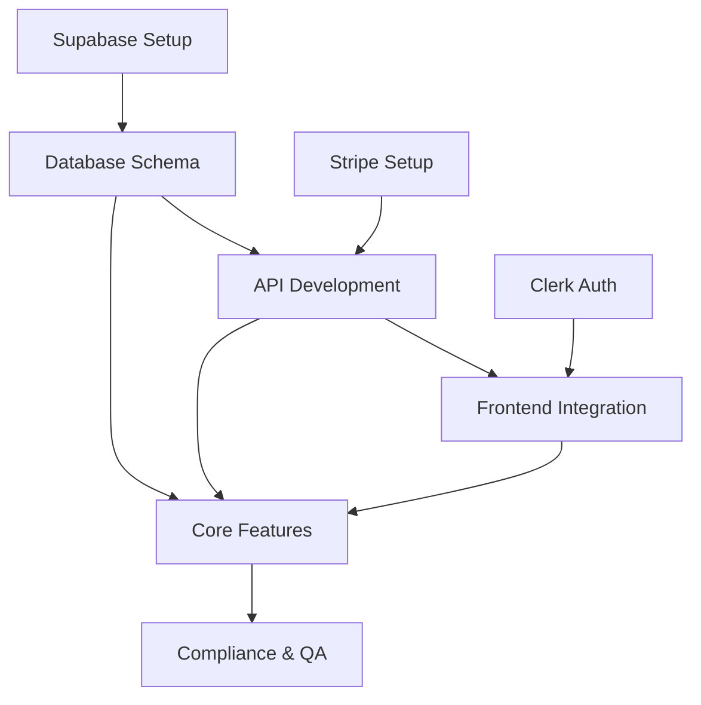

# CreditBeast Project Kickoff Blueprint

**Prepared by:** MiniMax Agent  
**Date:** November 6, 2025  
**Target Audience:** Technical Founder + AI Engineering Team

---

## Executive Summary

### Mission & Vision
CreditBeast is a **compliance-first SaaS platform** designed specifically for credit repair professionals. The mission is to provide an automation-driven system that transforms how credit repair businesses operate by:

- **Reducing onboarding time to under 24 hours** (from weeks/months)
- **Automating dispute generation in under 10 minutes** (from hours)
- **Recovering >40% of failed payments** through intelligent automation

### Core Value Proposition
A complete, compliant credit repair management system that eliminates manual processes while ensuring regulatory adherence through design.

---

## Technical Architecture Overview

### Tech Stack
```
Frontend: Next.js (React-based, server-side rendering)
Backend: FastAPI (Python, async-first, auto-documentation)
Database: Supabase (PostgreSQL with RLS, Auth, Storage)
Authentication: Clerk (Enterprise-grade auth with org management)
Payment: Stripe (Subscription billing with dunning management)
Email: CloudMail (Transactional + marketing automation)
Queue: Background job processing for async operations
```

### System Boundaries
- **B2B SaaS** with multi-tenant architecture
- **Organization-scoped data access** with Row Level Security (RLS)
- **API-first design** with comprehensive webhook support
- **Compliance-by-design** with audit logging and data encryption

---

## Development Sequence & Dependencies

### Phase 1: Foundation Setup (Week 1)
**Priority: Critical Path**

#### Repository & Infrastructure Setup
1. **Initialize monorepo structure** (`apps/web`, `apps/api`, `packages/shared`)
2. **Configure Supabase project** with RLS policies and encryption
3. **Set up Clerk authentication** with organization management
4. **Initialize Stripe** for subscription billing
5. **Configure CI/CD** pipelines for all services

#### Why This Order?
- **Auth foundation** required before any user-facing features
- **Database schema** needed before API development
- **Payment processing** essential for business model validation

---

### Phase 2: Data Model Implementation (Week 1-2)
**Dependencies:** Phase 1 Complete

#### Core Entities (Per DATA_MODEL.md)
```sql
-- Priority Order (Model Dependencies)
1. organizations (tenancy foundation)
2. users (authentication dependency)
3. clients (business logic core)
4. agreements (legal/compliance)
5. disputes (primary business value)
6. letters (automated workflows)
7. billing (revenue engine)
8. audit_logs (compliance requirement)
```

#### Implementation Steps
1. **Generate Supabase schema** from DATA_MODEL.md specifications
2. **Create TypeScript types** from database schema
3. **Implement Row Level Security (RLS)** policies
4. **Set up data encryption** for sensitive PII fields
5. **Create seed data** for development/testing

---

### Phase 3: API Foundation (Week 2-3)
**Dependencies:** Phase 2 Complete

#### API Development Order (Per API_DESIGN.md)
```typescript
// Implementation Sequence
1. /auth/*          // Authentication foundation
2. /leads/*         // Lead capture & conversion
3. /clients/*       // Client management
4. /disputes/*      // Core business logic
5. /billing/*       // Revenue operations
6. /webhooks/*      // External integrations
```

#### Technical Implementation
1. **Generate FastAPI routers** from API_DESIGN.md specifications
2. **Implement JWT authentication** with organization scoping
3. **Add request/response models** with validation
4. **Create webhook handlers** for Stripe events
5. **Set up API documentation** (auto-generated OpenAPI)

---

### Phase 4: Frontend Scaffolding (Week 2-3)
**Dependencies:** Phase 1 Complete

#### Component Architecture
```typescript
// Page Structure (Per UX_FLOWS.md)
1. Landing Page (Lead Capture)
2. Agreement Signup
3. Client Onboarding
4. Dispute Wizard
5. Mailing Dashboard
6. Billing Portal
```

#### Development Approach
1. **Set up Next.js with Clerk integration**
2. **Create layout components** (navigation, auth guards)
3. **Implement routing structure** per UX_FLOWS.md
4. **Build form components** with validation
5. **Add loading states** and error boundaries

---

### Phase 5: Core Feature Implementation (Week 3-6)

#### Vertical Slice Development Approach
Build complete user journeys from frontend to database:

**Slice 1: Lead → Agreement (Week 3)**
- Frontend: Landing page + agreement forms
- API: Lead capture endpoints
- Database: Lead and agreement tables
- Integration: Stripe customer creation

**Slice 2: Client Onboarding (Week 4)**
- Frontend: Multi-step onboarding wizard
- API: Client CRUD operations
- Database: Client data validation
- Integration: Document upload handling

**Slice 3: Dispute Generation (Week 5)**
- Frontend: Dispute wizard interface
- API: Automated dispute letter generation
- Database: Dispute tracking and history
- Integration: CloudMail for letter delivery

**Slice 4: Billing & Compliance (Week 6)**
- Frontend: Billing dashboard and invoices
- API: Subscription management
- Database: Payment tracking and audit logs
- Integration: Stripe webhooks and dunning

---

## Dependencies Map



**Critical Path:** Auth → Database → API → Frontend → Features

---

## Implementation Roadmap

### Sprint 1: Foundation (Week 1)
**Goal:** Working development environment with basic auth

**Deliverables:**
- [ ] Monorepo initialized with proper tooling
- [ ] Supabase project configured with RLS
- [ ] Clerk authentication integrated
- [ ] Basic Next.js frontend with auth flow
- [ ] FastAPI backend with health endpoints

**Success Metrics:**
- Developers can run full stack locally
- Users can sign up and authenticate
- Database connections established

### Sprint 2: Core Data (Week 2)
**Goal:** Complete data model with basic CRUD

**Deliverables:**
- [ ] All database tables created with RLS
- [ ] TypeScript types generated
- [ ] Basic API endpoints for all entities
- [ ] Frontend forms for client management

**Success Metrics:**
- All CRUD operations working
- Data validation enforced
- Organization scoping functional

### Sprint 3: Lead-to-Agreement Flow (Week 3)
**Goal:** Complete lead capture and agreement signup

**Deliverables:**
- [ ] Landing page with lead capture
- [ ] Agreement signing workflow
- [ ] Stripe customer creation
- [ ] Lead-to-client conversion process

**Success Metrics:**
- End-to-end lead conversion working
- Payments processing successfully
- User onboarding under 24h target

### Sprint 4: Dispute Automation (Week 4-5)
**Goal:** Automated dispute letter generation

**Deliverables:**
- [ ] Dispute wizard interface
- [ ] Template-based letter generation
- [ ] Automated mailing via CloudMail
- [ ] Tracking and status updates

**Success Metrics:**
- Dispute generation under 10min target
- Letters delivered successfully
- Status tracking accurate

### Sprint 5: Billing & Compliance (Week 6)
**Goal:** Revenue operations with audit compliance

**Deliverables:**
- [ ] Subscription billing dashboard
- [ ] Failed payment recovery (>40% target)
- [ ] Comprehensive audit logging
- [ ] Compliance reporting

**Success Metrics:**
- Payment recovery >40%
- Audit trails complete
- Compliance requirements met

---

## AI Coding Agent Kickoff Prompt

### Primary Implementation Prompt

```
CREDITBEAST MVP IMPLEMENTATION - PHASE 1

You are implementing a B2B SaaS platform for credit repair professionals. Use the provided specification files to guide your development:

**TECHNICAL STACK:**
- Frontend: Next.js with TypeScript, Tailwind CSS
- Backend: FastAPI with Python 3.11+
- Database: Supabase (PostgreSQL with RLS)
- Auth: Clerk authentication
- Payments: Stripe for subscriptions

**FILES TO REFERENCE:**
- VISION.md: Core mission and success metrics
- PLAN.md: Complete architecture specification  
- DATA_MODEL.md: Database schema with relationships
- API_DESIGN.md: Endpoint specifications with auth
- UX_FLOWS.md: User journey mappings
- TASKS.md: Development backlog by priority

**IMPLEMENTATION ORDER:**
1. Set up monorepo structure (apps/web, apps/api, packages/shared)
2. Configure Supabase with the schema from DATA_MODEL.md
3. Implement Clerk auth integration for organization management
4. Generate FastAPI endpoints per API_DESIGN.md specifications
5. Build Next.js frontend following UX_FLOWS.md journeys
6. Integrate Stripe for subscription billing

**KEY PRINCIPLES:**
- Compliance by design (audit logging, data encryption)
- Automation-first (minimize manual processes)
- Organization-scoped data access (RLS policies)
- Deterministic UX (predictable user flows)

**SUCCESS CRITERIA:**
- Users can onboard in under 24 hours
- Dispute generation completes in under 10 minutes
- Failed payment recovery >40%
- Full audit trail for compliance

Begin with Phase 1: Foundation setup and database schema implementation. Use the specification files as your source of truth for all technical decisions.
```

### Secondary Development Prompts

#### API Development Prompt
```
Using API_DESIGN.md as specification, generate FastAPI routers with:
- JWT authentication with organization scoping
- Pydantic models for request/validation
- Proper error handling and status codes
- OpenAPI documentation auto-generation
- Integration with Supabase for data operations
```

#### Frontend Development Prompt  
```
Using UX_FLOWS.md and SPEC.md, build Next.js components for:
- Multi-step onboarding wizard with progress tracking
- Dispute generation interface with template selection
- Billing dashboard with payment history
- Compliance reporting views
- Responsive design with Tailwind CSS
```

#### Database Implementation Prompt
```
Using DATA_MODEL.md schema, implement in Supabase:
- All tables with proper relationships and constraints
- Row Level Security (RLS) policies for organization isolation
- Data encryption for PII fields (SSN, DOB, addresses)
- Audit logging triggers for compliance
- Seed data for development and testing
```

---

## Quality Assurance Framework

### Testing Strategy
1. **Unit Tests:** API endpoints, utility functions, database operations
2. **Integration Tests:** End-to-end user journeys
3. **Security Tests:** Auth bypass, data access, injection vulnerabilities
4. **Performance Tests:** Load testing for concurrent users
5. **Compliance Tests:** Audit trail validation, data retention

### Compliance Checklist
- [ ] All PII encrypted at rest and in transit
- [ ] Complete audit logs for all data access/modifications
- [ ] Organization-scoped data isolation verified
- [ ] Data retention policies implemented
- [ ] User consent tracking for all data usage
- [ ] Automated compliance reporting

---

## Risk Mitigation

### Technical Risks
1. **Supabase RLS Complexity** → Start with simple policies, iterate
2. **Stripe Integration Issues** → Use Stripe CLI for local testing
3. **Performance at Scale** → Implement caching strategy early
4. **Compliance Gaps** → Regular security audits and penetration testing

### Business Risks
1. **Market Validation** → MVP focused on core value proposition
2. **Regulatory Changes** → Modular compliance system for updates
3. **Customer Adoption** → Build automation-first to prove ROI

---

## Success Metrics & KPIs

### Technical KPIs
- **Deployment Frequency:** Daily deployments to production
- **Lead Time:** <24h from code commit to production
- **MTTR:** <1 hour for critical issues
- **Uptime:** 99.9% availability target

### Business KPIs  
- **Time to Value:** <24h onboarding time
- **Automation Rate:** >90% of disputes auto-generated
- **Payment Recovery:** >40% failed payment recovery
- **User Satisfaction:** >4.5/5 NPS score

---

## Next Actions

### Immediate (This Week)
1. **Approve this kickoff blueprint** and technical approach
2. **Confirm MVP scope** matches business priorities
3. **Set up development team** with proper role assignments
4. **Initialize repository structure** and development environment

### Short-term (Week 1-2)
1. **Complete Phase 1: Foundation** setup and deployment
2. **Implement core database schema** with RLS policies
3. **Build authentication flows** with Clerk integration
4. **Create first vertical slice** (Lead-to-Agreement)

### Medium-term (Week 3-6)
1. **Deliver complete MVP** with all core features
2. **Achieve success metrics** for onboarding and automation
3. **Complete compliance audit** and security review
4. **Prepare for beta launch** with select credit repair professionals

---

**This blueprint provides the strategic roadmap to transform CreditBeast from specification to production-ready SaaS platform, ensuring compliance, automation, and measurable business value from day one.**